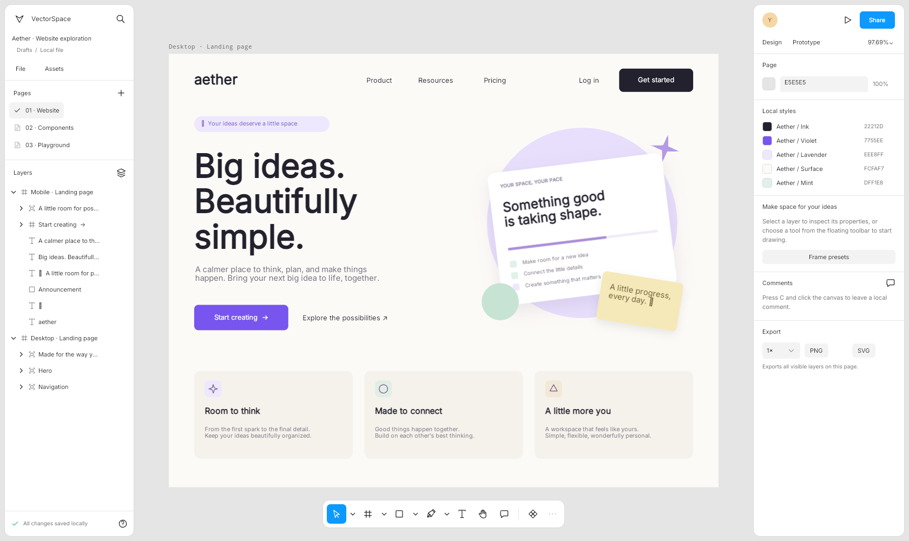

# VectorSpace

**A local-first vector design and prototyping editor built with Uno Platform and SkiaSharp.**

[](https://github.com/wieslawsoltes/VectorSpace/actions/workflows/build.yml)
[](https://github.com/wieslawsoltes/VectorSpace/actions/workflows/desktop.yml)
[](https://github.com/wieslawsoltes/VectorSpace/actions/workflows/pages.yml)
[](LICENSE)

VectorSpace brings a compact UI3-style workspace to a real Uno application: an infinite canvas, floating tool palette, layers and assets, contextual properties, local design systems, isolated prototype playback and a reusable SkiaSharp scene engine. The browser host runs C# in WebAssembly; it is **not an HTML mockup or an embedded third-party editor**.



**Status: 0.4.0-alpha.1.** Independent implementation with original code, icons and sample artwork. Not affiliated with Figma; no `.fig` import or claim of complete Figma feature/pixel parity. See the [feature boundary](docs/FEATURES.md).

## Browser and desktop

**[Open the browser editor](https://wieslawsoltes.github.io/VectorSpace/)** · **[Images and effects](docs/APPEARANCE.md)** · **[Prototyping guide](docs/PROTOTYPING.md)** · **[Design systems](docs/DESIGN_SYSTEMS.md)**

Windows, macOS, Linux and browser hosts share the same workbench and canvas. Browser recovery uses IndexedDB; desktop recovery uses the local application-data directory. **Save a local copy** downloads an editable `.vectorspace` document. Browser storage is not a backup service.

A successful **Pages** workflow is the deployment source of truth. GitHub Actions publishes the static app, and `build-info.json` identifies the exact deployed commit and version.

## Working features

- **Vector editing:** rectangles, rounded rectangles, ellipses, lines, arrows, polygons, stars, frames, sections, slices, cubic pen paths, freehand paths, editable text and Boolean operations.
- **Canvas interaction:** scoped/deep/marquee selection, move, eight anchored resize handles, rotation, modifier constraints, duplication, snapping, guides, rulers, grid, zoom-to-cursor, pan, touch gestures, outlines and inline text editing.
- **Layout and appearance:** layered fills, linear/radial gradients, strokes/dashes, opacity/blends, radius, independent drop/inner shadows, layer blur, typography, horizontal/vertical wrapping, grid tracks/spans, constrained fill, axis-preserving hug/fill resize, absolute children and edge/scale constraints.
- **Local design systems:** component sets and variants, linked instances, stable descendants, supported overrides, typed variables, aliases, inherited modes, dependency-aware clipboard operations and local comments.
- **Prototyping:** private playback, flow starts, ordered trigger/action sequences, typed conditions, navigation/back, modal overlays, frame scrolling, runtime variables, interactive variants, transitions and supported smart interpolation. Preview changes never alter editor history or saved design values.

**Try the prototype playground:** open **Prototype playground** from the main menu or quick actions, then **Present prototype**. The original scene demonstrates smart transitions, overlays, hover colors, scrolling and interactive state controls. Every visible element and interaction remains editable. See [exact playback semantics and limits](docs/PROTOTYPING.md).

**Design systems:** use **Local variables** in the menu or quick actions; bind properties and choose modes in the inspector. Add/combine component variants, insert from Assets and switch instance properties. See the [design-system guide](docs/DESIGN_SYSTEMS.md).

**Performance:** gesture-scoped indexed snapping, retained geometry/text caches, bounded image/gradient/effect resources, conservative filter-processing bounds, conservative viewport culling, unchanged-instance synchronization skips, selection-only layer updates, cached prototype view references and prepared interpolation trees. See [measurements and limitations](docs/PERFORMANCE.md). No whole-app FPS claim is made.

**Appearance studies:** open **Appearance playground** from quick actions; use **Place image** (Ctrl+Shift+K), edit Fill/Fit/Crop/Tile, crop directly on canvas, or configure layered effects. Gradient SVG paint servers and embedded raster images now import as editable paints. See [image, effect and SVG behavior](docs/APPEARANCE.md).

## Pinned toolchain

| Dependency | Version |
|---|---:|
| .NET SDK | 10.0.401 |
| Uno SDK | 6.7.30 |
| Uno WinUI, matched by SDK | 6.7.135 |
| SkiaSharp, matched to Uno's native runtime | 3.119.2 |
| Playwright | 1.63.0 |

Keep managed and native Skia versions aligned. The independently newest SkiaSharp release is not a safe substitute for Uno's matched dependency graph.

## Build and run

Install the SDK in `global.json`, Python 3 and Node.js 22+ for browser tests.

```bash
python3 scripts/fetch-assets.py

# Native Uno Skia host, without the browser workload
dotnet run --project src/VectorSpace.App -f net10.0-desktop \
  -p:VectorSpaceDesktopOnly=true

# WebAssembly development host
dotnet workload install wasm-tools
dotnet run --project src/VectorSpace.App -f net10.0-browserwasm

# Engine, layout, design-system and prototype regressions
dotnet run --project tests/VectorSpace.Tests -c Release
```

The asset script fetches Inter under SIL OFL 1.1 and retains its license. Font binaries are not committed.

### Static browser publication

```bash
dotnet publish src/VectorSpace.App -f net10.0-browserwasm -c Release \
  -o artifacts/publish -p:WasmShellWebAppBasePath=/VectorSpace/
python3 scripts/collect-site.py artifacts/publish artifacts/site
python3 scripts/serve-site.py --directory artifacts/site --port 4173
```

Use HTTP/HTTPS, not `file://`. For root-domain deployment use `WasmShellWebAppBasePath=/`. The local server reproduces the `/VectorSpace/` Pages base path.

```bash
npm ci
npx playwright install chromium
npm run test:browser
```

Browser tests drive real pointer, keyboard and file-picker events. `?test=1` exposes read-only state/control diagnostics, not a document-mutation API. Actions retains screenshots, traces, outputs and package archives. See [validation](docs/VALIDATION.md).

## Nine reusable libraries

| Package | Responsibility | UI dependency |
|---|---|---|
| `VectorSpace.Core` | Scene graph, variables/modes, reactions, affine geometry, paths | None |
| `VectorSpace.Layout` | Wrap/grid layout, constraints, indexed snapping | None |
| `VectorSpace.Documents` | JSON source generation/validation, SVG, samples, storage contract | None |
| `VectorSpace.Editing` | Selection, viewport, transactions/history, variables, components | None |
| `VectorSpace.Prototyping` | Deterministic playback, navigation, overlays, conditions and interpolation | None |
| `VectorSpace.Skia` | Design/presentation rendering, picking, Boolean paths, PNG | SkiaSharp |
| `VectorSpace.Controls` | Icons, dense primitives, numeric scrubbing, color picker | Uno / Skia |
| `VectorSpace.Editor` | Embeddable design surface and prototype player | Uno / Skia |
| `VectorSpace.Workbench` | Layers, inspector, palette and complete authoring workflows | Uno / Skia |

All nine libraries are packable. Generated `.nupkg`/`.snupkg` files do **not** imply publication to NuGet.org; public registry publication is separate.

```csharp
using VectorSpace.Documents;
using VectorSpace.Editing;
using VectorSpace.Workbench;

var session = new EditorSession(SampleDocument.Create());
// Supply your implementation of IWorkspaceStorage.
window.Content = new StudioWorkbench(session, storage);
```

Use the design engine without Uno:

```csharp
using VectorSpace.Documents;
using VectorSpace.Skia;

var document = DocumentJson.Load(File.ReadAllText("design.vectorspace"));
var frame = document.Pages[0].Nodes[0];
using var renderer = new SceneRenderer();
File.WriteAllBytes("frame.png", renderer.ExportPng([frame], frame.WorldBounds, 2));
```

The [prototyping guide](docs/PROTOTYPING.md#reuse-without-uno) shows UI-independent playback and the embeddable player.

## Keyboard essentials

| Action | Shortcut |
|---|---|
| Move / Frame / Rectangle / Ellipse | V / F / R / O |
| Pen / Pencil / Text / Comment | P / Shift P / T / C |
| Pan / cursor-anchored zoom | Space-drag / Ctrl-wheel |
| Multi-select / deep-select | Shift-click / Ctrl-click |
| Duplicate while dragging | Alt-drag |
| Undo / redo | Ctrl Z / Ctrl Shift Z |
| Group / ungroup / auto-layout | Ctrl G / Ctrl Shift G / Shift A |
| Nudge / large nudge | Arrow / Shift-arrow |
| Fit all / selected | Shift 1 / Shift 2 |
| Place image | Ctrl Shift K |
| Save / open / quick actions | Ctrl S / Ctrl O / Ctrl K |
| Hide panels / cancel / rename | Tab / Escape / F2 |
| Prototype restart / back / dismiss or exit | R / Backspace / Escape |

Native text inputs retain their own editing shortcuts. Browser-reserved keys and OS conventions vary. Low-level input, scrolling, focus, menus and dialogs use Uno primitives.

## Persistence, CI and releases

Native schema **4** migrates version-1/2/3 documents on load and preserves legacy prototype links. SVG/PNG are interchange/rendering outputs, not lossless substitutes for the editable native document. `.fig`, hosted collaboration, cloud history and plugin execution are not implemented.

**Build** validates engines and publication metadata, publishes and tests the real browser application, benchmarks snapping equivalence and packs libraries. **Desktop** compiles Windows/Linux/macOS. **Pages** deploys successful main-branch Build artifacts and tests the public URL. **Release** validates tagged snapshots and publishes source/browser/package archives with checksums. An artifact upload is not a live deployment.

See [architecture](docs/ARCHITECTURE.md), [feature boundaries](docs/FEATURES.md), [contributing](CONTRIBUTING.md), [security](SECURITY.md), and [changelog](CHANGELOG.md).

## License and references

MIT for original VectorSpace source, icons and samples. Dependencies retain their licenses; Inter is SIL OFL 1.1. Figma is a trademark of its respective owner and is referenced only for requested design/interaction behavior.

Technical references: [Uno SDK](https://platform.uno/docs/articles/features/using-the-uno-sdk.html), [SKCanvasElement](https://platform.uno/docs/articles/controls/SKCanvasElement.html), [SkiaSharp](https://github.com/mono/SkiaSharp), [Figma reaction documentation](https://developers.figma.com/docs/plugins/api/Reaction/).
